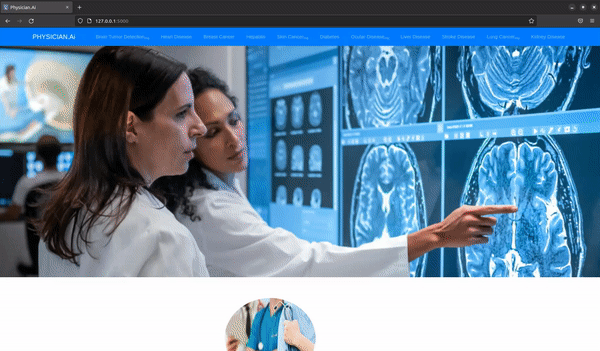
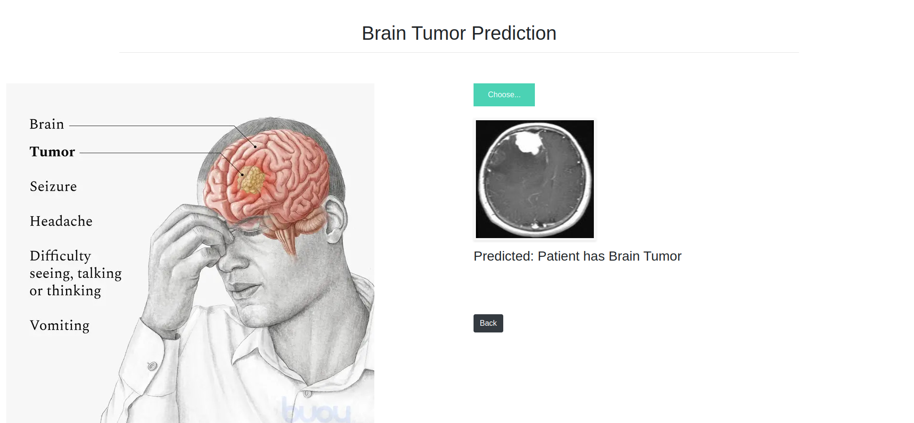
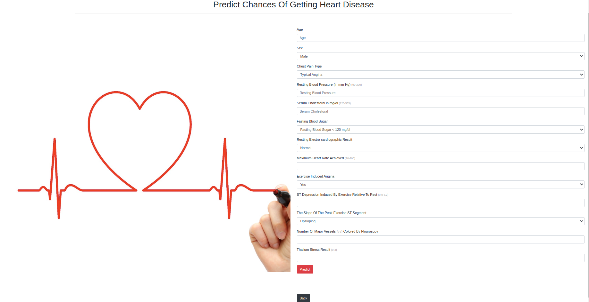
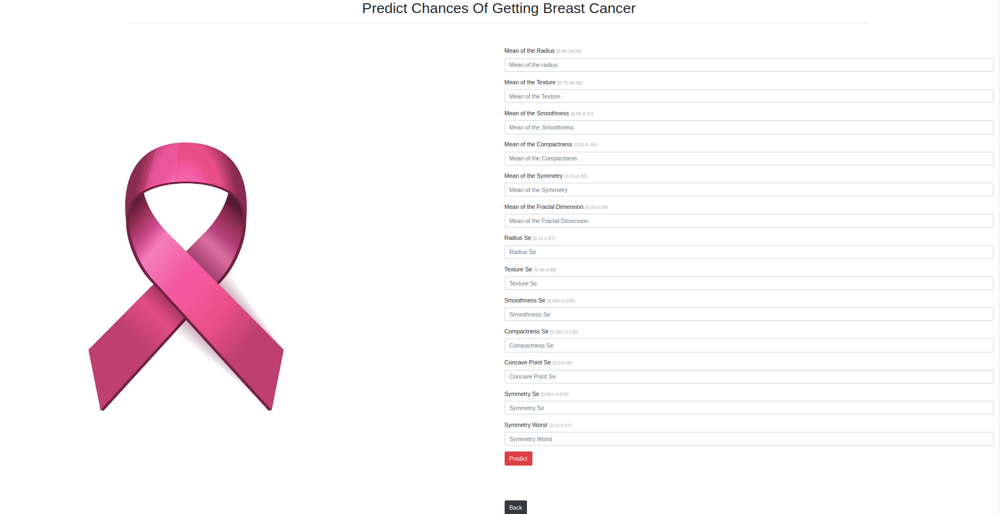
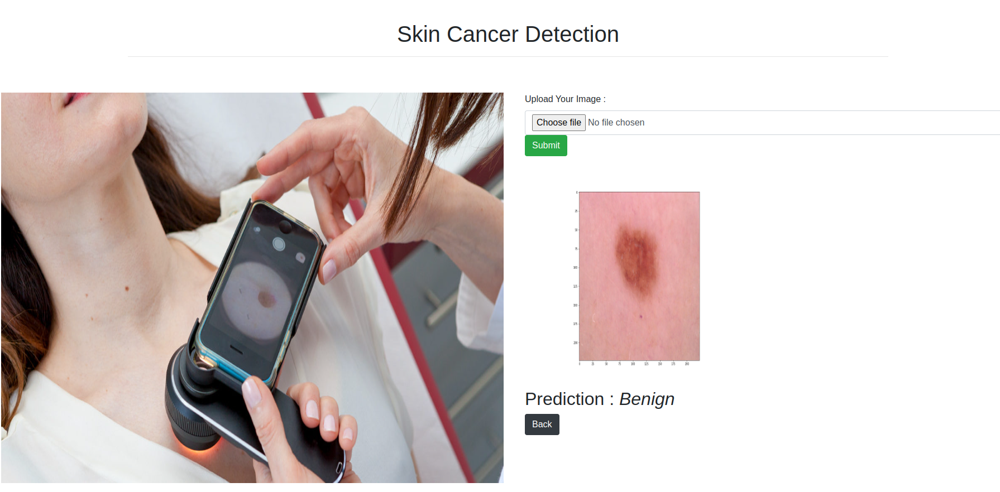
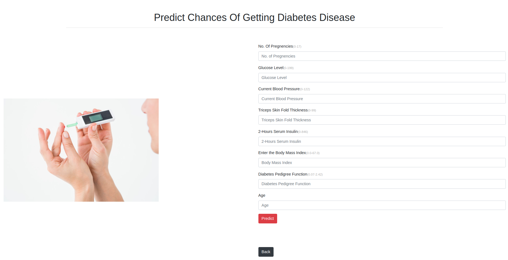
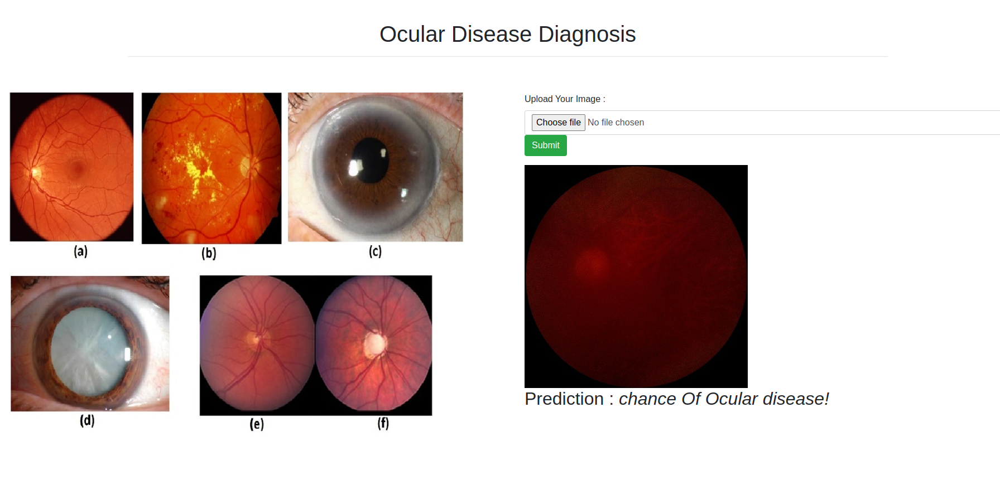
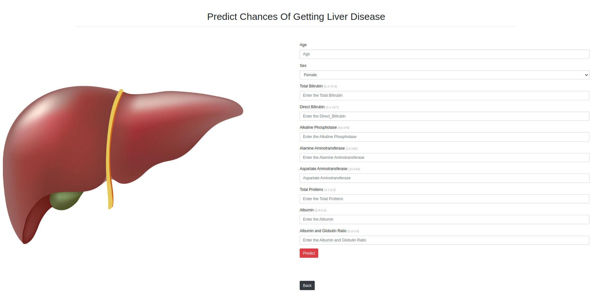
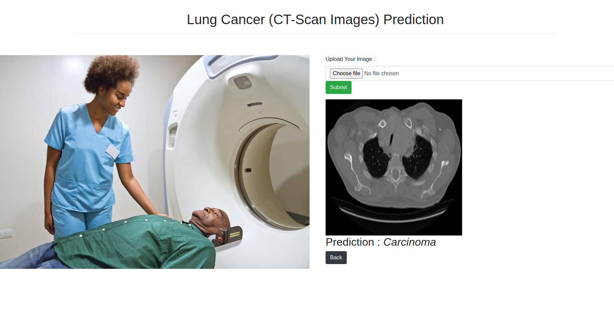
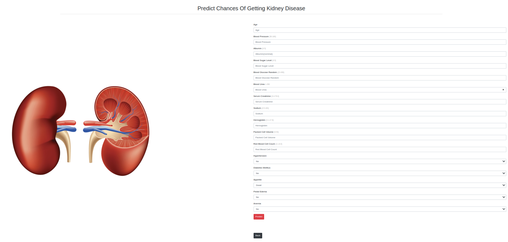

<h1 align='center'>Physician.Ai</h1>

# Hi 👋, This project illustrates using AI in healthcare.

 

------------------------------------------------------------------------
## **Applications**

### Brain Tumor

- [Brain Tumor Dataset](https://www.kaggle.com/datasets/navoneel/brain-mri-images-for-brain-tumor-detection)
- [Jupyter Notebook](https://github.com/FraidoonOmarzai/Physician.Ai/blob/main/Trained%20Model/brain%20tumor/Brain_Tumor.ipynb)
- Accuracy: 81%

  
  <br /><br />

### Heart Disease Prediction

- [Heart Disease Dataset](https://www.kaggle.com/datasets/johnsmith88/heart-disease-dataset)
- [Jupyter Notebook](https://github.com/FraidoonOmarzai/Physician.Ai/blob/main/Trained%20Model/Heart-Model/heart.ipynb)
- Accuracy: 99%

  
  <br /><br />

### Breast Cancer Prediction

- [Breast Cancer Dataset](https://www.kaggle.com/datasets/uciml/breast-cancer-wisconsin-data)
- [Jupyter Notebook](https://github.com/FraidoonOmarzai/Physician.Ai/blob/main/Trained%20Model/breast-cancer/Breast%20Cancer.ipynb)
- Accuracy: 94%

  
  <br /><br />

### Hepatitis Disease Prediction

- [Hepatitis Dataset](https://www.kaggle.com/datasets/fedesoriano/hepatitis-c-dataset)
- [Jupyter Notebook](https://github.com/FraidoonOmarzai/Physician.Ai/blob/main/Trained%20Model/hepatitis/Hepatitis.ipynb)
- Accuracy: 98%

  
  <br /><br />

### Skin Cancer Detection

- [Skin Cancer Dataset](https://www.kaggle.com/datasets/fanconic/skin-cancer-malignant-vs-benign)
- [Jupyter Notebook](https://github.com/FraidoonOmarzai/Physician.Ai/blob/main/Trained%20Model/skin%20cancer/skin_cancer.ipynb)
- Accuracy: 86%

  
  <br /><br />

### Diabetes Prediction

- [Diabetes Dataset](https://www.kaggle.com/datasets/mathchi/diabetes-data-set)
- [Jupyter Notebook](https://github.com/FraidoonOmarzai/Physician.Ai/blob/main/Trained%20Model/Diabet/Diabet.ipynb)
- Accuracy: 82%

  
  <br /><br />

### Ocular Disease Detection

- [Ocular Dataset](https://www.kaggle.com/datasets/andrewmvd/ocular-disease-recognition-odir5k)
- [Jupyter Notebook](https://github.com/FraidoonOmarzai/Physician.Ai/blob/main/Trained%20Model/ocular/OcularDisease.ipynb)
- Accuracy: 94%

  
  <br /><br />

### Liver Disease Prediction

- [Liver Disease Dataset](https://www.kaggle.com/datasets/uciml/indian-liver-patient-records)
- [Jupyter Notebook](https://github.com/FraidoonOmarzai/Physician.Ai/blob/main/Trained%20Model/liver/liver.ipynb)
- Accuracy: 79%

  
  <br /><br />

### Stroke Disease

- [Stroke Disease Dataset](https://www.kaggle.com/datasets/fedesoriano/stroke-prediction-dataset)
- [Jupyter Notebook](https://github.com/FraidoonOmarzai/Physician.Ai/blob/main/Trained%20Model/stroke/Stroke.ipynb)
- Accuracy: 99%

  
  <br /><br />

### Lung Cancer

- [Lung cancer Dataset](https://www.kaggle.com/datasets/mohamedhanyyy/chest-ctscan-images)
- [Jupyter Notebook](https://github.com/FraidoonOmarzai/Physician.Ai/blob/main/Trained%20Model/ct%20scan%20lung%20cancer/chest_ct_scan_image.ipynb)
- Accuracy: 86%

  
  <br /><br />

### Kidney Disease Prediction

- [Kidney Disease Dataset](https://www.kaggle.com/datasets/mansoordaku/ckdisease)
- [Jupyter Notebook](https://github.com/FraidoonOmarzai/Physician.Ai/blob/main/Trained%20Model/kidney/kidney.ipynb)
- Accuracy: 97%

  
  <br /><br />


------------------------------------------------------------------------

## Used Tools And Technology

- Visual Studio, Atom, PyCharm, Jupyter Notebook
- Python
- Flask
- Numpy
- Pandas
- Matplotlib
- Seaborn
- Sklearn
- ML Algorithms
- Xgboos
- Joblib
- Pickle
- Tensorflow
- Transfer Learning Algorithms
- cv2
- PIL
- os


## Installation

```bash
  pip install -r requirements.txt
```
------------------------------------------------------------------------
## Steps Involeved In Projects

- Import libraries
- Get the Dataset
- EDA
  - Check The dataset rows and columns along with data types
  - Check the null values
  - Check whether balance or imbalance dataset
  - Check the outliers
  - Check the relationship of features
- Feature Engineering
  - Handling missing values
  - Handling imbalance dataset
  - Handling outliers
- Feature Selection
- Train different Model and select the best one
- Test the model
- Save the model

------------------------------------------------------------------------
------------------------------------------------------------------------
This repository was created by:  
- [Fraidoon Omarzai](https://www.linkedin.com/in/fraidoon-omarzai-8592131b4/)
------------------------------------------------------------------------
------------------------------------------------------------------------
