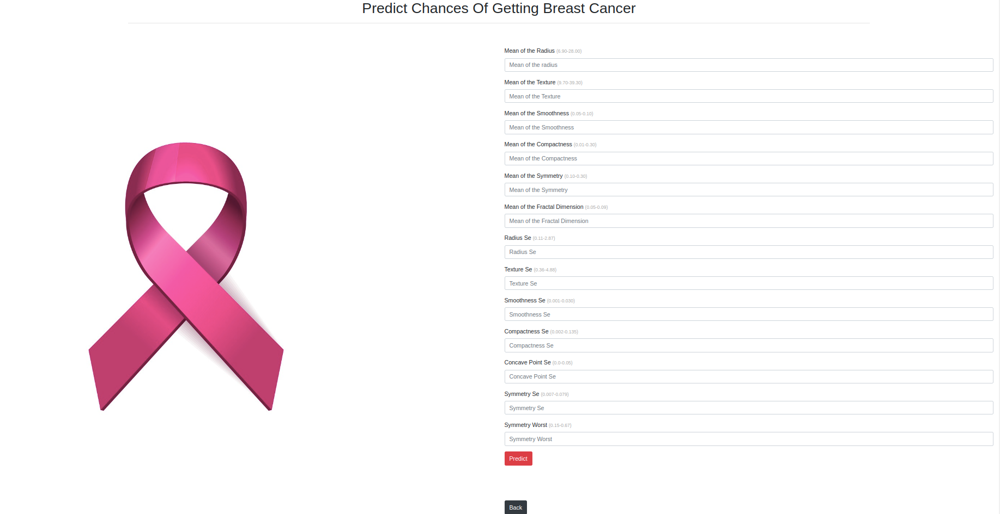
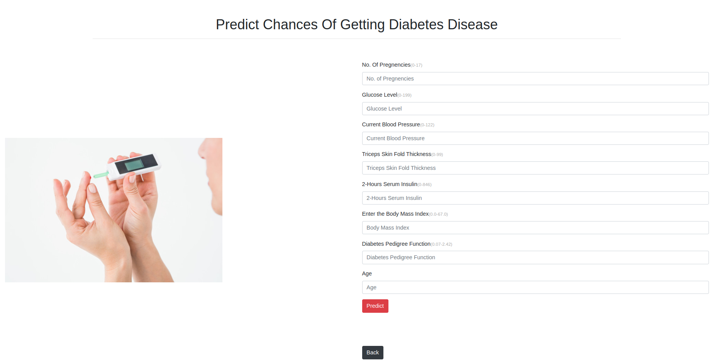
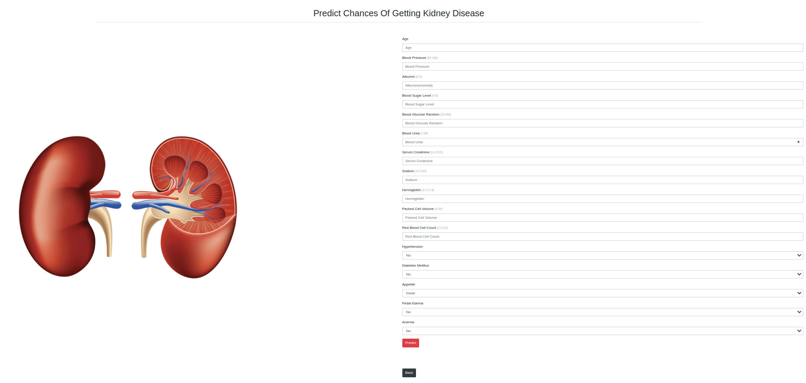
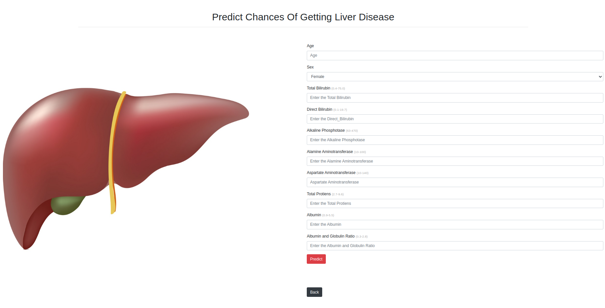
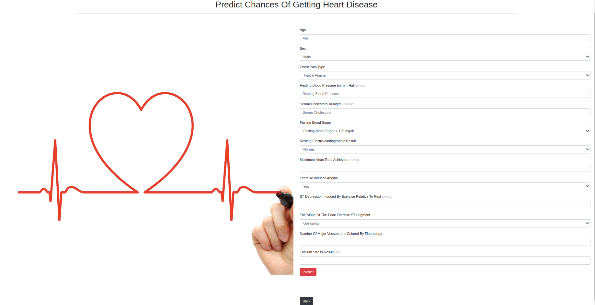
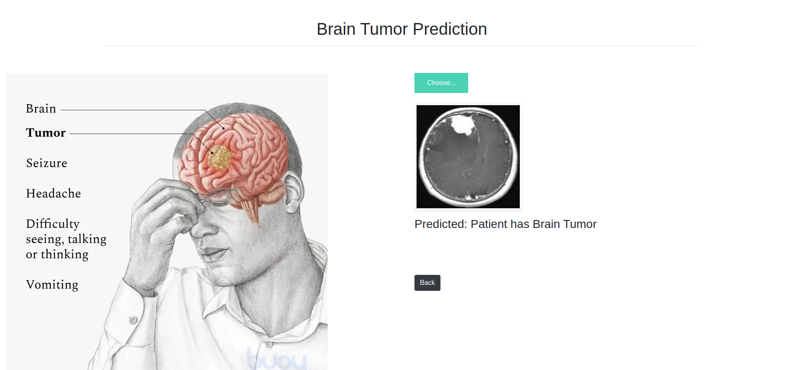

<h1 align='center'>Search.Ai</h1>

# Hi guys 👋, This project is focusing on using AI in healthcare. 

## **Applications**

- Breast Cancer Prediction 
    
- Diabetes Prediction 
    
- Kidney Disease Prediction 
    
- Liver Disease Prediction 
    
- Heart Disease Prediction 
    
- Brain Tumor 
  

## Installation

- Visual Studio, Atom, PyCharm, Jupyter Notebook
- Python
- Flask
- Numpy
- Pandas
- Matplotlib
- Seaborn
- Sklearn
- Xgboos
- Joblib
- Pickle
- Tensorflow
- cv2
- PIL
- os

<h1 align='center'>Not completed yet!</h1>
