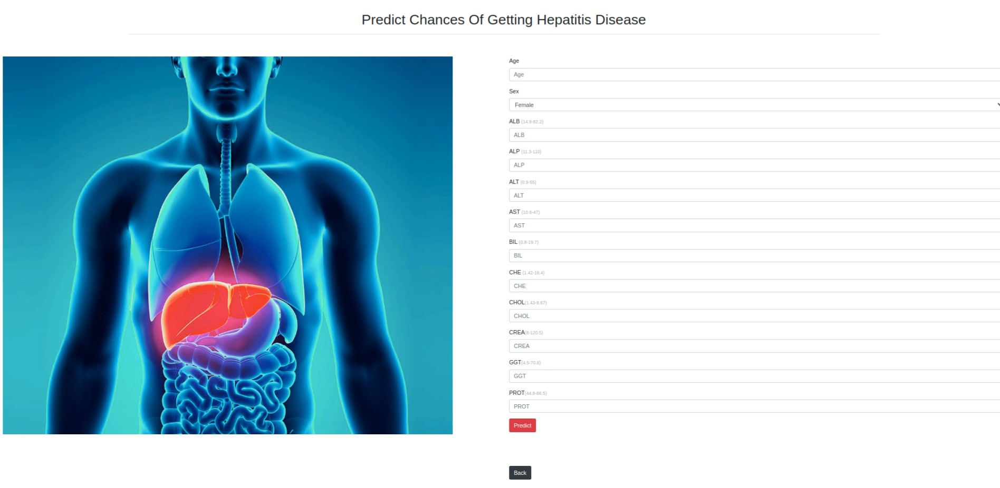

<h1 align='center'>Physician.Ai</h1>

# Hi guys 👋, This project illustrates using AI in healthcare.

## **Applications**

### Brain Tumor

- [Brain Tumor Dataset](https://www.kaggle.com/datasets/navoneel/brain-mri-images-for-brain-tumor-detection)
  
    

### Heart Disease Prediction

- [Heart Disease Dataset](https://www.kaggle.com/datasets/johnsmith88/heart-disease-dataset)
  
    

### Breast Cancer Prediction

- [Breast Cancer Dataset](https://www.kaggle.com/datasets/uciml/breast-cancer-wisconsin-data)
  
    

### Hepatitis Disease Prediction

- [Hepatitis Dataset](https://www.kaggle.com/datasets/fedesoriano/hepatitis-c-dataset)
  
    

### Diabetes Prediction

- [Diabetes Dataset](https://www.kaggle.com/datasets/mathchi/diabetes-data-set)
  
    

### Liver Disease Prediction

- [Liver Disease Dataset](https://www.kaggle.com/datasets/uciml/indian-liver-patient-records)
  
    

### Stroke Disease

- [Stroke Disease Dataset](https://www.kaggle.com/datasets/fedesoriano/stroke-prediction-dataset)
  
    

### Kidney Disease Prediction

- [Kidney Disease Dataset](https://www.kaggle.com/datasets/mansoordaku/ckdisease)
  
    

## Used Tools

- Visual Studio, Atom, PyCharm, Jupyter Notebook
- Python
- Flask
- Numpy
- Pandas
- Matplotlib
- Seaborn
- Sklearn
- Xgboos
- Joblib
- Pickle
- Tensorflow
- cv2
- PIL
- os

<h1 align='center'>Not completed yet!</h1>
